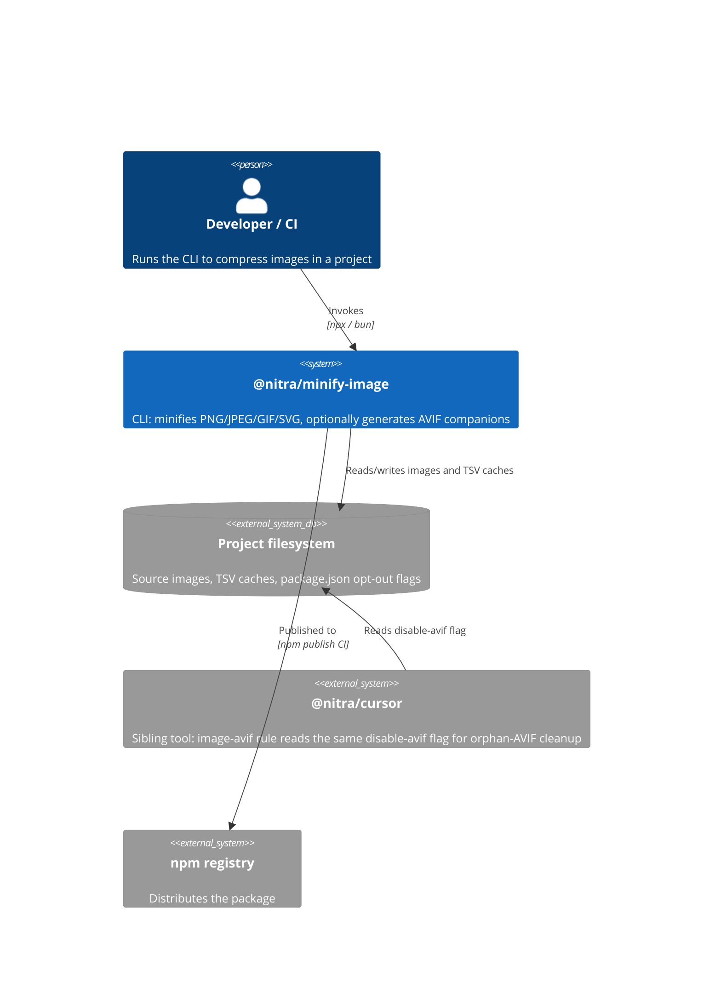
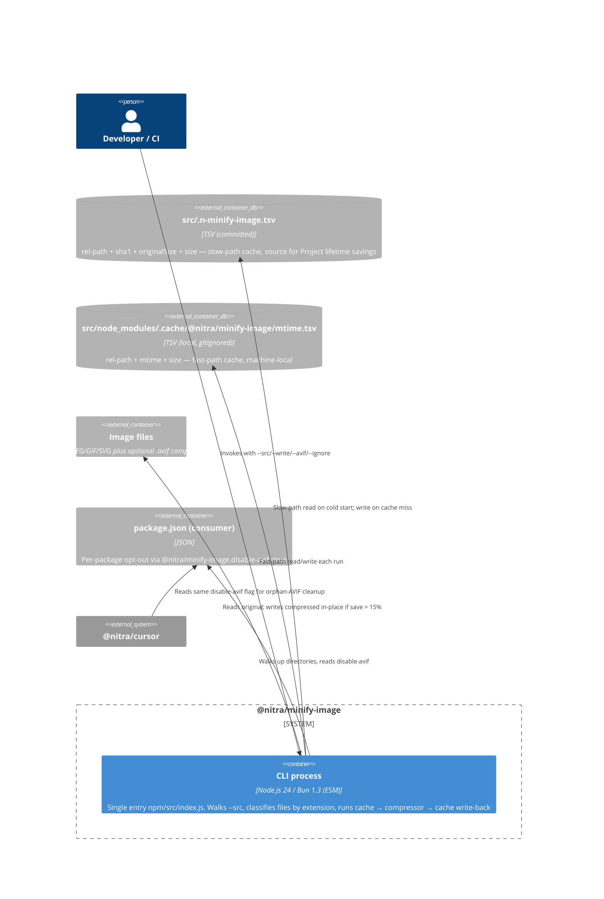
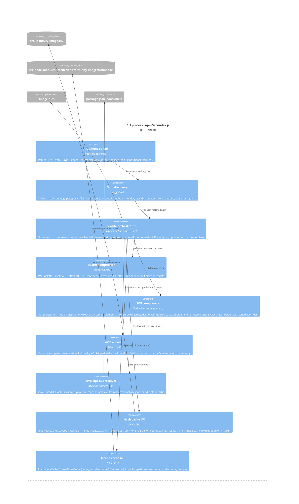

# Architecture (C4 model)

Source of truth for `@nitra/minify-image` design. Read this **before** any
change that adds/removes integrations, components, or shifts dependency
direction. Update this file in the same PR as the code change — see
[`.cursor/rules/n-ci4.mdc`](../../.cursor/rules/n-ci4.mdc).

Notation: [C4 model](https://c4model.com). Mermaid `C4Context` /
`C4Container` / `C4Component` blocks render natively on GitHub; the source
text is also readable as-is.

## Level 1 — System Context

Who interacts with `@nitra/minify-image`, and which external systems it
talks to.

## Level 2 — Containers

`@nitra/minify-image` is a single short-lived CLI process. External storage
and consumers are repeated from level 1 as concrete artifacts the CLI
touches.

## Level 3 — Components (CLI process)

All components live in [npm/src/index.js](../../npm/src/index.js) — a single
file is intentional (small surface, trivial `bun run` import, no internal
boundaries to maintain). The component view groups functions by
responsibility.

## Component → tests

Each component links to the test that exercises it. Cache contracts and the
SVG branch are heavily covered; new branches must add a test next to one
of these files.

| Component                                                                  | Test file                                                                                                                                                                           |
| -------------------------------------------------------------------------- | ----------------------------------------------------------------------------------------------------------------------------------------------------------------------------------- |
| Argument parser, globWalker, processOne, rasterCompress (golden path)      | [demo/test/run.test.js](../../demo/test/run.test.js) — `estimate-режим` + `--write режим` blocks, vendor/test/dist exclusion                                                        |
| svgCompress                                                                | [demo/test/run.test.js](../../demo/test/run.test.js) — `SVG: ...` blocks (sprite skip, license-bearing comments, `<metadata>` preservation, attribution markers, CC0 + © edge case) |
| avifGen + avifResolver                                                     | [demo/test/avif-opt-out.test.js](../../demo/test/avif-opt-out.test.js) — opt-out fixture with nested workspaces, broken package.json tolerance, `disable-avif: false` no-op         |
| Default ignore for `src-tauri/icons/**` (glob + AVIF segment)              | [demo/test/tauri-icons-default-ignore.test.js](../../demo/test/tauri-icons-default-ignore.test.js)                                                                                  |
| Hash cache + mtime cache contract (cold start, hit/miss, lifetime savings) | [demo/test/run.test.js](../../demo/test/run.test.js) — `--write …наповнює cache` + `--write …перезаписує файл коли економія >15%`                                                   |

## Decisions

Architectural decisions live in [docs/adr/](../adr/). Inbox entries
(`docs/adr/_inbox/`) are auto-captured drafts (see
[`.cursor/rules/n-adr.mdc`](../../.cursor/rules/n-adr.mdc)); promote them to
numbered ADRs after review. When a decision adds, removes, or relocates a
component above, the same PR must update this file — that is the contract
in [`.cursor/rules/n-ci4.mdc`](../../.cursor/rules/n-ci4.mdc).
